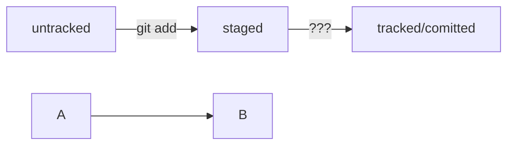

# Краткий конспект Git-уроков от Яндекс

## Инициализация (создание) репозитория
Для того чтобы создать новый git репозиторий необходимо перейти в папку, которая должна будет стать git-репозиторием и ввести команду: 
``` 
git init
```
После чего данная папка станет репоизиторием с поддержкой котроля версий. В текущей директории появится скрытая папка __.git__. Ее удаление 
приведет к тому, что директория перестанет отслеживать системой контроля версий, все истории изменений будут утрачены, останется только
последняя версия проекта, хранящаяся в директории на момент удаления скрытой папки. Удалить можно так: 
```
rm -rf .git
```
### !Не рекомендуется создавать репозиторий Git внутри другого Git-репозитория. 

##  Отслеживание состояний
Команда:
```
git status
```
Позволяет посмотреть текущее состояние репозитория
## Добавление файлов к отслеживанию
Чтобы добавить файлы к отслеживанию системой контроля версий необходимо выполнить команду:
```
git add --all
```
или
```
git add .
```
Так к отслеживанию будут добавлены все файлы из текущего каталога, также их можно добавять по именам файла, указывая после _add_ имя каждого файла, 
который необходимо добавить к отслеживанию.
«Сделать коммит» значит сохранить текущую версию файла.
### !git add только добавляет файлы к списку отслеживания, но не сохраняет их

## Коммиты
Коммит гарантирует, что изменения будут сохранены в истории и при необходимости к ним можно будет «откатиться».
Сначала команда git add сообщает Git, какие именно файлы нужно сохранить и какую их версию. Затем с помощью команды git commit происходит само сохранение.
Коммит выполняется командой:
```
git commit -m 'текст сообщения'
```
Текст сообщения должен быть информативным сообщением о внесенных в файлы изменениях
## Изменение последнего коммита
С опцией __--amend__ команда commit не создаст новый коммит, а дополнит последний, просто добавив в него файл common.css. При этом хеш последнего коммита изменится, потому что изменился список файлов в коммите.
## Просмотр коммитов
Команда:
```
git log
```
позволяет просмотреть историю коммитов.
## Полезная информация 
Каждый коммит сохраняет актуальное состояние файлов. Сами же коммиты хранятся в ветках.
Если коммит — это снимок состояния файлов, то ветка — временна́я шкала, на которой расположены эти снимки. Ветка всегда начинается от одного из коммитов.
Начальная ветка создаётся автоматически и называется main или master.
## Удаленный сервер
Предварительно нужно связать локальный репозиторий с GitHub или иной системой хранения СКВ. Сделать это можно командой:
```
git remote add origin git@github.com:<username>/<reponame>
```
За отправку изменений на удалённый репозиторий отвечает команда:
```
git push
```
Для первого коммита необходимо добавить параметры в команду:
```
git push -u origin master
```
## Хэши коммитов
Git хранит таблицу соответствий хеш → информация о коммите. Если вы знаете хеш, вы можете узнать всё остальное: автора и дату коммита и содержимое закоммиченных файлов. Можно сказать, что хеш — основной идентификатор коммита.
## Сокращенный вывод логов
```
git log --oneline
```
Данная команда обеспечивает вывод хэшей коммитов минимальной длины, необходимой для их однозначной интерпретации в рамках репозитория
## HEAD
В числе прочих файлов в папке .git есть служебный файл HEAD. Он указывает на самый свежий коммит.
Вместо хеша последнего коммита можно написать слово HEAD — Git вас поймёт.

## Git Status
- Команда git status всегда подскажет, что происходит с файлом: например, он добавлен в список «на коммит» или ещё вообще не отслеживается, или изменён.
- git status показывает явно следующие состояния файлов: untracked, staged и modified.
- git status подсказывает, какие команды можно выполнить, чтобы поменять состояние файла.
## Убрать файл из staged
вы создали или изменили какой-то файл и добавили его в список «на коммит» (staging area) с помощью git add, но потом передумали включать его туда. 
Убрать файл из staging поможет команда 
```
git restore --staged <file>
```
 (от англ. restore — «восстановить»). При указанн '.' вместо имени файла будут сброшенны все файлы добавленные в staged
## Вернуться к состоянию репозитория с заданным коммитом
```
git reset --hard <commit hash>
```
Возвращает репозиторий к состоянию на момент commit hash, переданный коммит становится последним, все изменения внесенные после него в коммитах удаляются.

## Отменить изменение файла
Если файл был случаной измененн и попал в modified, то его можно вернуть к тому состоянию в котором он был командой:
```
git restore <file>
```
## Git diff (Просмотр изменений)
Команда:
```
git diff
```
сравнит последнюю закоммиченную версию файла с той, что находится в состоянии modified.  
Команда
```
git diff --staged
```
покажет изменения в staged-файлах относительно последних закоммиченных версий.
Команда:
```
git diff A B
```
выводит список инструкций: как превратить состояние A в состояние B. Если поменять B и A местами  
(git diff B A), то и инструкции будут обратные: как превратить B в A. При этом зеленные строки  
станут красными и наоборот.
